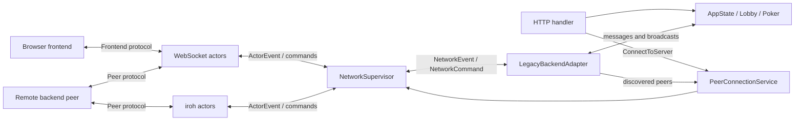

# Backend

**native_mcg** is the native backend of Mental Card Game (MCG).
It is an asynchronous Rust application built with **Tokio** and **Axum**.
It serves the browser frontend and media assets, drives the current poker
implementation and bots, and connects the local node to frontends and other
backend peers.

The backend currently exposes:

- an HTTP API at `/api/message`,
- a WebSocket endpoint at `/ws`,
- an iroh-over-QUIC endpoint for frontend and backend-peer connections,
- static routes for the browser application, generated WASM, and media.

## Current Architecture

The networking layer separates byte-oriented transports from application state.
A connection actor understands one transport and one protocol role, but it
cannot access the lobby, game, or bot state.
Actors report typed events to a central `NetworkSupervisor`;
application code sends typed commands in the opposite direction.

::: info Current implementation and goal state
The application layer is still transitional:
`LegacyBackendAdapter` connects the new networking layer to the existing
lock-based `AppState` and poker logic.
:::

### Network Types

The transport-neutral types are defined in
[`native_mcg/src/network/types.rs`](https://github.com/mentalcardgames/mcg/blob/main/native_mcg/src/network/types.rs):

- **`ConnectionId`** identifies one live, process-local transport connection.
  It is not sent over the wire and is not a persistent identity.
- **`PeerId`** identifies a remote backend independently of a particular
  connection. For iroh this is the authenticated remote endpoint ID.
- **`ProtocolRole`** distinguishes frontend traffic from peer traffic.
- **`TransportKind`** records whether a connection uses WebSocket or iroh.
- **`PeerConnectionDirection`** records whether the local node accepted or
  initiated a peer connection.
- **`NetworkEvent`** reports connection readiness, typed inbound messages, and
  connection closure to application code.
- **`NetworkCommand`** sends typed frontend or peer messages and requests
  connection closure.
- **`ConnectionCloseReason`** preserves whether a connection ended remotely,
  because of a transport or protocol error, or through a local request.

### Network Supervisor and Handle

[`NetworkSupervisor`](https://github.com/mentalcardgames/mcg/blob/main/native_mcg/src/network/supervisor.rs)
owns the connection registry, connection actor tasks, bounded outbound queues,
and in-progress outgoing iroh connection attempts. It assigns `ConnectionId`s
and is the authoritative source of transport, protocol-role, peer-identity,
and direction metadata.

Application and transport code use a cloneable `NetworkHandle` rather than
accessing the supervisor directly. The handle can:

- register upgraded WebSockets and accepted iroh streams;
- configure the iroh endpoint used for outgoing connections;
- establish an outgoing iroh peer connection;
- deliver a `NetworkCommand`; and
- request orderly shutdown.

Commands are validated against connection metadata. Sending a frontend message
to a peer connection, for example, returns a protocol-mismatch error. Bounded
channels expose backpressure explicitly instead of allowing unbounded message
growth. Outgoing iroh setup also has a timeout and reports ticket, transport,
and setup failures as structured `NetworkError` values.

### Connection Actors

Transport actors live in:

- [`native_mcg/src/network/websocket.rs`](https://github.com/mentalcardgames/mcg/blob/main/native_mcg/src/network/websocket.rs); and
- [`native_mcg/src/network/iroh.rs`](https://github.com/mentalcardgames/mcg/blob/main/native_mcg/src/network/iroh.rs).

Each actor owns one reader/writer pair and a private outbound command channel.
It deserializes inbound frames into the message enum appropriate for its
protocol role and serializes typed outbound commands. It reports `Ready`,
message, identity, and `Closed` events to the supervisor. It deliberately has
no reference to `AppState`.

## Transport Protocols

### HTTP

`POST /api/message` accepts a JSON `Frontend2BackendMsg` and returns a
`Backend2FrontendMsg`. The handler is implemented in
[`native_mcg/src/server/http.rs`](https://github.com/mentalcardgames/mcg/blob/main/native_mcg/src/server/http.rs).

Most messages are passed to the existing `dispatch_client_message` application
handler. `ConnectToServer` is special: it delegates to `PeerConnectionService`
so HTTP callers use the same validation and duplicate-suppression path as
connections initiated through peer discovery. HTTP is request/response only
and does not subscribe to pushed frontend updates.

### WebSocket

[`native_mcg/src/server/ws.rs`](https://github.com/mentalcardgames/mcg/blob/main/native_mcg/src/server/ws.rs)
upgrades `/ws` requests, selects their protocol role, and registers the socket
with the supervisor. The supported WebSocket subprotocols are:

- `mcg.frontend` for `Frontend2BackendMsg` / `Backend2FrontendMsg`; and
- `mcg.peer` for `Peer2PeerMsg` between backends.

A request without a subprotocol is accepted as a legacy frontend connection.
An unsupported explicit subprotocol is rejected.

An incoming peer WebSocket must first send `WebSocketPeerHandshake`, which
claims a syntactically valid iroh endpoint ID. The socket remains pending until
that handshake succeeds or its timeout expires. Unlike an iroh connection,
this claimed WebSocket identity is **not authenticated**; application code must
not treat it as cryptographic proof of the remote peer's identity.

### iroh

[`native_mcg/src/server/iroh.rs`](https://github.com/mentalcardgames/mcg/blob/main/native_mcg/src/server/iroh.rs)
owns the listener endpoint, persists or restores its secret key, publishes the
local endpoint ticket, accepts QUIC connections, and registers accepted streams
with the supervisor.

Two ALPN values keep frontend and peer traffic separate:

- `mcg/iroh/frontend` carries the frontend protocol; and
- `mcg/iroh/peer` carries `Peer2PeerMsg` values.

Both use newline-delimited JSON over a bidirectional QUIC stream. For peer
connections, iroh supplies an authenticated remote endpoint ID, which becomes
the transport-independent `PeerId`. The configured endpoint is also installed
in the supervisor so outgoing peer connections use the same connection actor
and lifecycle as accepted connections.

## Peer Connection Coordination

[`PeerConnectionService`](https://github.com/mentalcardgames/mcg/blob/main/native_mcg/src/server/peer_connections.rs)
is the single application-level entry point for outgoing iroh peer
connections. It:

1. parses the endpoint ticket and derives the expected `PeerId`;
2. rejects attempts to connect to the local endpoint;
3. reserves the peer while setup is pending, suppressing concurrent duplicate
   attempts;
4. asks the supervisor to establish and register the transport connection; and
5. sends the initial `Peer2PeerMsg::Connect` introduction.

The service also tracks established incoming and outgoing peer connections. If
both peers connect to each other at the same time, both nodes choose the same
winner deterministically from their ordered peer IDs and connection direction.
The redundant connection is closed, leaving one stable connection per peer.

## Application Adapter and State

[`LegacyBackendAdapter`](https://github.com/mentalcardgames/mcg/blob/main/native_mcg/src/server/network_adapter.rs)
is the temporary boundary between the actor-based network layer and the current
application implementation. It consumes `NetworkEvent`s and:

- forwards frontend messages to `dispatch_client_message`;
- subscribes frontend connections that send `Frontend2BackendMsg::Subscribe`;
- routes `Backend2FrontendMsg` broadcasts to subscribed connections;
- applies `Peer2PeerMsg` lobby, discovery, naming, readiness, and disconnect
  behavior;
- forwards peer broadcasts to active peer connections; and
- removes connection and peer metadata after closure.

The current [`AppState`](https://github.com/mentalcardgames/mcg/blob/main/native_mcg/src/server/state.rs)
still uses shared `Arc<RwLock<...>>` state.
It owns the poker lobby, bot configuration, frontend and peer broadcast
senders, persisted server configuration, local iroh ticket, and known-peer
information.

When poker state changes, `broadcast_state` produces a `PokerStatePublic` and
sends `Backend2FrontendMsg::UpdatePokerState`. The adapter delivers the update
to every subscribed frontend actor. Peer lobby messages use the separate peer
broadcast path.

This adapter preserves the existing poker behavior while the application layer
moves toward the goal-state Controller and Game Engine ownership model.

## Server Startup and Shutdown

The executable entry point in
[`native_mcg/src/main.rs`](https://github.com/mentalcardgames/mcg/blob/main/native_mcg/src/main.rs)
loads configuration, initializes tracing and `AppState`, chooses the first
available port starting at 3000, and calls `run_server`.

[`run_server`](https://github.com/mentalcardgames/mcg/blob/main/native_mcg/src/server/run.rs)
then:

1. creates the `NetworkSupervisor`, `NetworkHandle`, `PeerConnectionService`,
   and `LegacyBackendAdapter`;
2. spawns the supervisor, adapter, and bot-driver tasks;
3. builds the Axum router with the application and networking handles;
4. starts the iroh listener and configures its endpoint in the supervisor; and
5. serves HTTP and WebSocket traffic with Axum.

On server termination, the iroh listener is stopped, the supervisor is asked
to shut down its connection actors, and the owned supervisor and adapter tasks
are joined. Owned task handles also abort their tasks if router state is
dropped unexpectedly.

### Multi-Instance Local Testing (P2P / Lobby)

To test peer-to-peer lobby connection and QR-code scanning locally on the same development machine:

- **Automatic Port Fallback**: If port 3000 is occupied, subsequent backend instances automatically bind to 3001, 3002, etc.
- **Node ID Independence**: By default, each backend loads `mcg-server.toml` which contains a persisted `iroh_key`. If two backend instances share this file, both have the identical Node ID, and P2P connection attempts will fail with `NetworkError::LocalEndpoint`.
- **Solutions**:
  - **Ephemeral Mode**: Run with `--ephemeral` (`just backend --ephemeral`). The node generates a random secret key in memory and avoids persisting or reading `iroh_key` from disk.
  - **Separate Configurations**: Run with `--config <FILE>` (e.g. `just backend --config mcg-server-2.toml --port 3001`). This persists separate keys for each node.

## Browser Assets and Routes

The Axum router serves:

- `/health` for a JSON health response;
- `/api/message` for HTTP protocol messages;
- `/ws` for frontend and peer WebSockets;
- `/pkg` for generated WASM artifacts;
- `/media` for media assets; and
- `/` plus non-API fallback paths for the single-page application.

The backend must be run with the repository root as its working directory so
that `index.html`, `pkg/`, and `media/` resolve correctly.

## Verification

The networking layer includes unit tests for supervisor routing, protocol-role
validation, backpressure, timeouts, closure, peer identity, and duplicate-peer
resolution. Integration tests cover real loopback iroh frontend and peer
connections, while WebSocket tests cover subprotocol selection, peer identity
handshake, typed message exchange, and connection closure.
