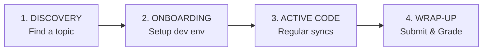

# Participation Lifecycle

Welcome to the Mental Card Games project! Whether you are here for a practical project or a thesis, this page guides you through the full process—from selecting a topic, setting up your environment, checking in during development, up to your final code submission and grading.

We structure your journey into four clear phases to minimize friction and ensure a successful project.

## The Four-Phase Student Funnel

---

## 1. Discovery & Topic Selection

The first step is identifying a technical backlog task or research area that excites you and aligns with your background.

1. **Explore the Backlog:** Review the open research and software development items listed in our [Student Milestones Backlog](/project/milestones).
2. **Understand the Expected Workload:** Workload expectations are adjusted dynamically based on your project type (e.g., a short practical vs. a multi-month thesis). You do not need to worry about rigid point counts; instead, your supervisor will brief you on the expected scope.
3. **Connect with Supervisors:** Reach out to the supervisors listed on the [Active Registry (People)](/organisational/people) page. Together, you will refine the project boundaries, adjust specific deliverables, and map out the first tasks.

---

## 2. Onboarding & Environment Setup

Once your topic is finalized, you will establish your developer workspace. This phase aims to get you fully set up and familiar with the system architecture.

1. **Read the Blueprints:** Make sure you study:
   - The [System Architecture](/project/architecture) page to understand components, actor model data flows, and system boundaries.
   - The [Repository Layout & Modules](/project/modules) page to understand crate dependencies and the codebase structure.
2. **Set Up Your Toolchain:** Follow our step-by-step developer environment manual in the [Developer Setup Guide](/organisational/contribute).
3. **Join Communication Channels:** Ask your supervisor to invite you to our internal chat server (e.g., Discord) and verify you have access to the GitHub organization.

---

## 3. Active Research & Coding

This is the main phase of your project. We promote an open, collaborative environment where students support each other.

* **Regular Syncs & Exchange:** While there is no rigid clock-in requirement, it is highly recommended as a developer best practice to participate in regular exchange with your supervisor and other active students. This ensures that you stay aligned, resolve blockers quickly, and enjoy a collaborative peer environment.
* **Coordinate Dependencies:** Look at the [Active Registry (People)](/organisational/people) to see what other students are building. Since the project uses a shared monorepo, early communication on API changes or protocol enhancements prevents merge conflicts.
* **Submit Iterative Pull Requests:** Avoid massive "end-of-semester" code dumps. Frequent, smaller pull requests (PRs) make review easier and help maintain stable compilation across the monorepo.

---

## 4. Project Wrap-up & Grading

As your project nears completion, you will transition to the final evaluation phase.

1. **Code Handover:** All code must be submitted via a final pull request on GitHub. Your code must format correctly (`cargo fmt`), compile with zero warnings (`cargo clippy`), and pass the existing workspace tests (`cargo test`).
2. **Documentation & Reports:** Ensure any new crates, modules, or features you build are documented in the code via rustdocs. Thesis students will submit their written report according to university regulations.
3. **Evaluation Metrics:** Your final score/grade is determined by a holistic evaluation of the following areas:
   - **Technical Correctness & Safety:** Code design, robustness, test coverage, and adherence to system invariants.
   - **Documentation Quality:** Complete code comments, clear commit logs, and helpful documentation updates.
   - **Supervision & Proactiveness:** Active participation in regular syncs, independence in solving problems, and communication.
   - **Research Depth:** The scientific innovation and analytical depth demonstrated in the project (especially for thesis work).
4. **Knowledge Preservation:** Once graded, your research report and code contribution will be archived to ensure future generations of students can build upon your accomplishments!
