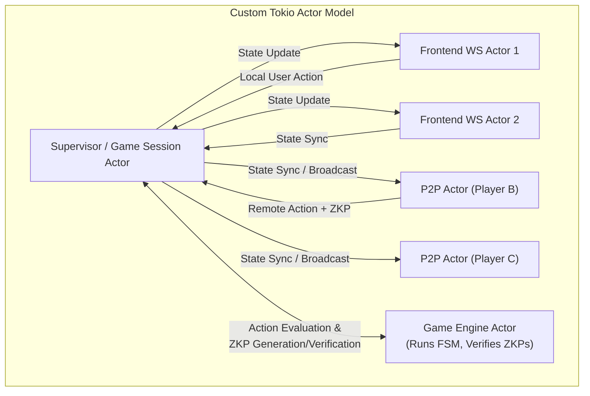
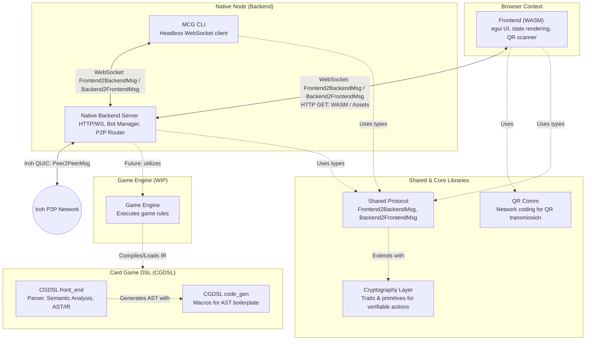
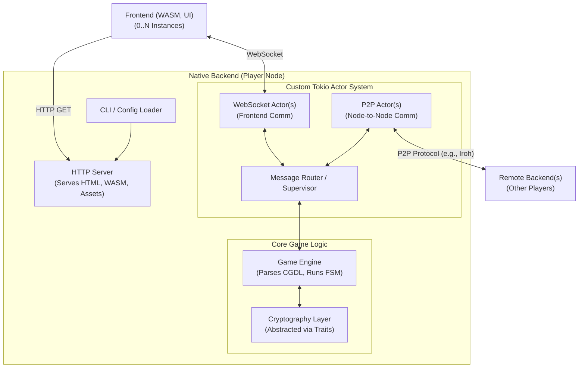
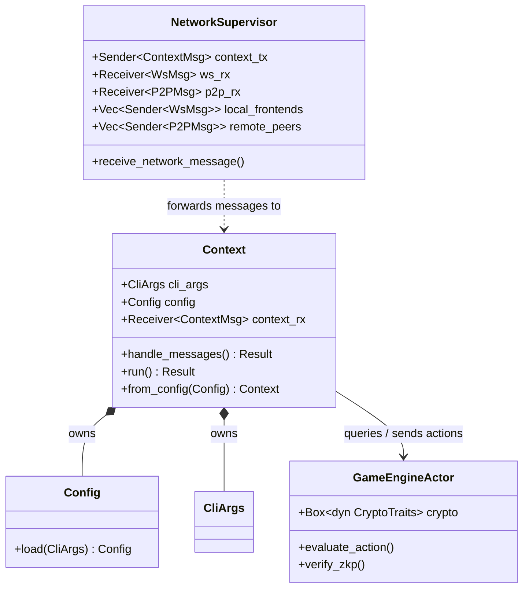

# Architecture

## Overview

The application follows a **Frontend-Backend / P2P Node** architecture. Currently, state is authoritative on the Backend and replicated to Frontends via WebSockets. However, the system is designed around a **Split Node** concept where each player runs their own Backend and Frontend, eventually communicating peer-to-peer.

- **Frontend**: A WebAssembly (WASM) application built with Rust and `egui` (via `eframe`). It runs in the browser.
- **Backend**: A Rust native application building on `axum` and `tokio`. It manages the game state, serves assets, and handles network transport.
- **Shared / Cryptography**: Common crates containing data structures, game logic, communication protocols, and cryptographic primitives for verifiable actions.
- **CGDSL**: A Card Game Domain-Specific Language designed to formalize rules and generate game execution state machines.

## Architectural Concepts

### 1. Split Node Architecture
The system is designed around a **Split Node** concept.
- **Each Player is a Node**: Every user runs a full instance comprising both the WASM Frontend and the Native Backend.
- **Thin Client**: The Frontend is strictly a view layer ("Game state -> Pretty pictures"). It handles input and rendering but contains minimal game logic.
- **Native Power**: The Backend handles all heavy lifting: game engine execution, cryptography (ZK proofs), and P2P networking. This bypasses WASM limitations (sandboxing, lack of threading/sockets).

### 2. P2P & Transports
The system supports multiple transport layers:
- **WebSockets**: For communication between a Frontend and its local Backend. (Using `Frontend2BackendMsg` and `Backend2FrontendMsg` as message types)
- **Iroh**: A P2P library used for node-to-node communication (with `Peer2PeerMsg`), featuring NAT traversal and hole punching.
- **QR Codes**: An alternative transport for exchanging data (and potentially bootstrapping connections) in air-gapped or localized settings.

### 3. Actor-Based Connection Model

To handle the complexity of multiple asynchronous connections (Frontends and Remote Peers), the backend utilizes a custom Tokio-based Actor Model using channels for message passing. This ensures that the state processes actions sequentially and prevents race conditions.



**Message Flow Example: Player takes an action**

1. **Local Action**: The player selects an action in one of their connected Frontends.
2. **WebSocket Routing**: The corresponding `Frontend WS Actor` receives the message and forwards it via a `tokio` channel to the `Supervisor`.
3. **Execution & Proof**: The `Supervisor` sends a message to the dedicated `Game Engine Actor` via a channel. The Engine Actor evaluates the action, uses the `Cryptography Layer` to generate a Zero-Knowledge Proof, and transmits the result back to the `Supervisor`.
4. **State Update**: The local authoritative state is updated by the `Supervisor`.
5. **Broadcast**: The `Supervisor` sends the action and its ZKP to all connected `P2P Actors` and broadcasts the new state to all `Frontend WS Actors`.
6. **Network Transmission**: The `P2P Actors` forward the data to the connected Remote Nodes.
7. **Remote Verification**: When a Remote Node receives the message, its `Supervisor` forwards the ZKP to its own `Game Engine Actor` for verification through its crypto traits before applying the state transition.


## System Components & Interfaces

The following diagram illustrates the boundaries and communication paths within a single player's Node, as well as its connection to the outside world. The following diagram illustrates the components in the workspace and their relationships.



### New Actor Model



## Module Responsibilities

### 1. Frontend (`frontend/`)
The frontend is the user's entry point. It handles:
- **Rendering**: Uses `egui` immediate mode GUI.
- **State Management**: Holds a local replica of `GameStatePublic`.
- **Routing**: Manages screens (`/receive`, `/transmit`, `/game`, etc.) via a registry.
- **Camera/QR**: Wraps browser media APIs (via `web-sys`) to capture video frames for QR scanning.

### 2. Backend (`native_mcg/`)
The native server application. It handles:
- **Game Engine Integration**: Utilize the Game Engine to step through game loops.
- **HTTP/WS Server**: Serves the WASM assets and handles WebSocket connections at `/ws`.
- **Asset Serving & CLI**: Parses command-line arguments and runs an HTTP server to serve the HTML, compiled WASM, and other artifacts required by the frontend.
- **Connection Management (Custom Tokio Actors)**: Concurrently manages local WebSocket connections (to frontends) and P2P connections (to other players' backends). The actor system is a custom, lightweight implementation built natively on top of `tokio` channels (e.g., `tokio::mpsc`).
- **Game Engine (CGDL)**: Parses Card Game Domain Specific Language (CGDL) files to understand the rules and state machine of the current game.
- **Action Verification**: The engine processes incoming actions and verifies them using the cryptography layer before transitioning the game state.

### 3. Shared (`shared/`)
Contains the "business logic" and "domain objects":
- **Protocol Enums**: `Frontend2BackendMsg`, `Backend2FrontendMsg`, and `Peer2PeerMsg` define the serialization contracts.
- **Game Types**: Core poker logic like `Game`, `Player`, `Card`.

### 4. Cryptography Layer (WIP)
A dedicated layer (living within `shared/communication` and upcoming modules) for Mental Card Game mechanics:
- **Verifiable Actions**: Provides traits and structures (e.g., `ElgamalCiphertext`, `ModularElement`) so that MCG actions (like drawing or shuffling cards) can be cryptographically verified by other players without trusting a central server.
- **Protocols**: Supports ZK proofs and encrypted state transitions.

### 5. Card Game DSL (CGDSL)
A bespoke language and compiler toolchain designed to generalize the game rules beyond hardcoded poker.
- **`front_end`**: The compiler front-end that parses `.cg` files. It converts the syntax into an Abstract Syntax Tree (AST), performs semantic validation, and lowers the logic into an Intermediate Representation (IR) / Finite State Machine (FSM).
- **`code_gen`**: A macro-heavy crate that automates the generation of spanned ASTs (retaining code source locations) to remove structural boilerplate.
- **Future Integration**: A dedicated Game Engine (currently on the `dev/akeller` branch) runs the IR generated by this DSL. The Native Backend will utilize this Game Engine to execute arbitrary card games.

### 6. QR Comm (`crates/qr_comm/`)
Implements the protocol for transmitting data over a series of QR codes.
- **Network Coding**: Uses Galois Field arithmetic to create linear combinations of data fragments.
- **Fountain Code**: Allows the receiver to reconstruct the original data from *any* sufficient subset of received frames, handling packet loss gracefully.

## Backend

### Network & Connection Lifecycle

1. **Out-of-Protocol Discovery**: Initial peer discovery is handled out-of-protocol. For example, a player might scan a QR code or copy a connection string from another player to bootstrap the first connection.
2. **In-Protocol Advertisement**: Once an initial connection is established, further peers are discovered via in-protocol gossip or advertisements (e.g., Player A introduces Player B to Player C).
3. **Frontend Independence**: The backend does not depend on a connected frontend to maintain these P2P connections or process background state. Frontends can connect or disconnect at will without interrupting the node's P2P responsibilities.

### File Structure

The project has been restructured to cleanly separate the communication layer from the core backend logic, and to extract the game engine into its own independent crate. The following diagram illustrates this organization using a tree view representation.

```text
Workspace
├── native_mcg
│   └── src
│       ├── main.rs
│       ├── lib.rs
│       ├── context.rs
│       └── communication
│           ├── mod.rs
│           ├── supervisor.rs
│           ├── ws.rs
│           └── p2p.rs
└── engine
    └── src
        ├── actor.rs
        └── lib.rs
```

- **`native_mcg/src/context.rs`**: The heart of the native backend. This module defines the `Context` struct, CLI argument parsing, configuration loading, and core business logic handling.
- **`native_mcg/src/communication/`**: Contains the implementations for the actor model. This includes the `NetworkSupervisor` (which abstracts the network layer) and the specific transport actors (`ws.rs` for WebSockets, `p2p.rs` for Iroh peer-to-peer).
- **`engine/`**: The Game Engine has been moved out of the backend into its own dedicated crate. It operates as its own actor (`actor.rs`), capable of receiving and transmitting messages independently.

---

### Class / Struct Diagram

In this architecture, the **Network Supervisor** serves purely as an abstraction layer for the **Context**. When a network message is received by a tiny connection task (either via a WebSocket from a local frontend or over Iroh from a remote peer), the task forwards it to the Supervisor's MPSC channel. The Supervisor's receive method then forwards it to the Context. The Context then processes the message, updating its state or interacting with the Game Engine as needed.



#### Key Relationships

1. **Context Initialization**: `main.rs` parses the `CliArgs` and loads the `Config` which in turn is used to initialize the `Context`.
2. **Network Abstraction**: The `NetworkSupervisor` shields the `Context` from the intricacies of connection management. It holds all connections into which the context can write. Tiny connection tasks forward incoming messages into the Supervisor's channels (`ws_rx`, `p2p_rx`), and the Supervisor funnels them to the `Context` via `context_tx`.
3. **Engine Independence**: The `GameEngineActor` resides in a separate crate and evaluates the actions based on the cryptographic traits. The `Context` interacts with it via message passing.


## Cryptography Abstraction

Since multiple ZKP protocols will be implemented to support the various mental card game requirements, the cryptography layer is heavily abstracted behind **Traits**. The Game Engine interacts exclusively with these traits rather than concrete implementations, allowing for flexibility, swapping of protocols, and cleaner testing.
