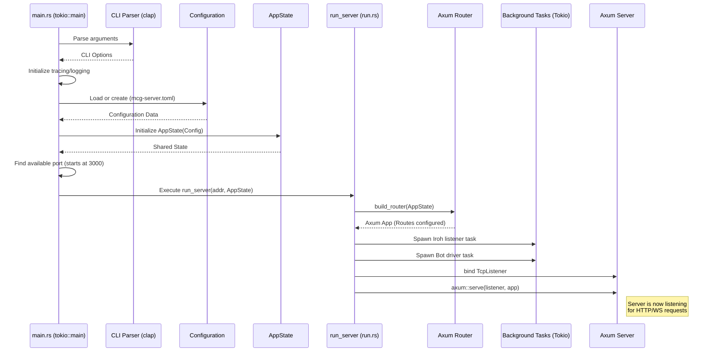

# Backend

**native_mcg** is the backend for the MCG (Mental Card Game) poker server. It is a Rust async server built with **Tokio** and **Axum**. It serves the Web UI (HTML, WASM, and media), exposes a **WebSocket** endpoint (`/ws`) and an **HTTP API** (`/api/message`) for the frontend, and optionally an **Iroh** QUIC transport for peer-to-peer or remote clients. The protocol and domain types (`ClientMsg`, `ServerMsg`, `GameStatePublic`, etc.) live in the **mcg-shared** crate; both the backend and the frontend depend on it.

## Architecture & API

The core interaction logic is built around managing the game state concurrently for multiple connected clients and providing different ways to connect and interact.

### Core Structs & Modules

- **`AppState`** @ [native_mcg/src/server/state.rs](https://github.com/mentalcardgames/mcg/blob/main/native_mcg/src/server/state.rs):
  - **Purpose**: Holds the shared application state information, determining how the backend should behave.
  - **Usage**: Contains the `Lobby` (which holds the game state and bot configurations), a broadcast channel sender for pushing updates, and server configuration. It's safe to share across threads using `Arc<RwLock<Lobby>>` and injected into Axum handlers as `State(state)`.

- **`axum::routing::Router`**:
  - **Purpose**: Defines where different kinds of incoming requests should be forwarded to and how they are handled.
  - **Usage**: Created in `build_router` in [server/run.rs](https://github.com/mentalcardgames/mcg/blob/main/native_mcg/src/server/run.rs). It maps endpoints like `/ws` to the WebSocket handler and `/api/message` to the HTTP handler.

- **`Subscription`** @ [native_mcg/src/server/state.rs](https://github.com/mentalcardgames/mcg/blob/main/native_mcg/src/server/state.rs):
  - **Purpose**: Acts as a synchronization gateway between multiple frontends.
  - **Usage**: The backend can establish connections with multiple frontends, so we want to have a way to broadcast messages to all frontends such that every frontend sees the same thing. Returned by `subscribe_connection` and holds a `broadcast::Receiver<ServerMsg>`.

- **`Lobby`** @ [native_mcg/src/server/state.rs](https://github.com/mentalcardgames/mcg/blob/main/native_mcg/src/server/state.rs):
  - **Purpose**: Manages the current active game session and bot-related state.
  - **Usage**: Encapsulates the `Game` instance, tracks which `PlayerId`s are controlled by bots, and holds the `BotManager`.

### Initialization & Lifecycle

The server is started from the **native_mcg** binary. The program entry point is `main` in [native_mcg/src/main.rs](https://github.com/mentalcardgames/mcg/blob/main/native_mcg/src/main.rs), which is annotated with `#[tokio::main]` to run on the async Tokio runtime.

1. **CLI parsing**: Arguments are parsed via `ServerCli` (Clap). Supported options include `--config`, `--debug`, `--iroh-key`, and `--persist`.
2. **Logging setup**: A tracing subscriber is initialized with an env filter based on debug mode.
3. **Configuration**: `Config::load_or_create` loads configuration from a TOML file.
4. **Shared state**: `AppState::new` is called with the loaded config to build the shared server state.
5. **Port binding**: Finds an available port starting from 3000.
6. **Server run**: `run_server(addr, state)` (in [native_mcg/src/server/run.rs](https://github.com/mentalcardgames/mcg/blob/main/native_mcg/src/server/run.rs)) brings the server up. It performs the following concurrently:
    - **Build Router**: Creates the Axum application router.
    - **Spawn Iroh**: Starts a background task for the Iroh peer-to-peer listener.
    - **Spawn Bot Driver**: Starts a background task loop (`run_bot_driver`) to evaluate AI turns.
    - **Serve HTTP**: Binds the TCP listener and executes `axum::serve(listener, app)`, blocking execution until shutdown.

### Accepting Connections

The backend supports three different types of connections to clients: HTTP, WebSocket, and Iroh.

- **HTTP**: HTTP is the most straightforward connection type as there is no session management. The responding message is directly returned inline as the response to the POST request. Handled by `message_handler` in [native_mcg/src/server/http.rs](https://github.com/mentalcardgames/mcg/blob/main/native_mcg/src/server/http.rs).
- **WebSocket and Iroh**: Both WebSocket and Iroh are more complicated as they need to manage a long-lived connection/session allowing for full-duplex communication and state push updates.
  - WebSocket connections are upgraded and managed by `manage_websocket` in [native_mcg/src/server/ws.rs](https://github.com/mentalcardgames/mcg/blob/main/native_mcg/src/server/ws.rs).
  - Iroh connections are managed by `manage_iroh_connection` in [native_mcg/src/server/iroh.rs](https://github.com/mentalcardgames/mcg/blob/main/native_mcg/src/server/iroh.rs).

> **Note**: Regardless of connection type, all handlers are injected with the same `AppState` to share the same game context.

### Receiving Messages

All three connection types, after successfully parsing incoming data as a `ClientMsg` JSON payload, forward that message to a single unified handler for processing:

```rust
// Defined in native_mcg/src/server/state.rs
pub async fn dispatch_client_message(state: &AppState, cm: ClientMsg) -> ServerMsg { ... }
```

1. **Routing**: The transport layers receive byte/text data and deserialize it.
2. **Processing**: The `ClientMsg` is passed to `dispatch_client_message`, which validates game logic, mutates the state (if it's an Action, NextHand, etc.), and triggers broadcasts.
3. **Responding**: The function returns a `ServerMsg` (e.g., `ServerMsg::State` or `ServerMsg::Error`), which the transporter then sends back to the client that initiated the request.

### State Synchronization & Push Updates

When the game state is modified (e.g., via `apply_action_to_game`), the server needs to inform connected clients.

1. **Broadcast Call**: The handler calls `broadcast_state(state)`.
2. **Channel Push**: This serializes the public projection of the game (`GameStatePublic`) and sends `ServerMsg::State` over the `tokio::sync::broadcast` channel located in `AppState`.
3. **Transport Delivery**: Long-lived transports (like the WebSocket event loop in `manage_websocket`) `select!` on this channel receiver and immediately push the new state down the socket to the client. HTTP clients do not receive push notifications.

### Connections with other nodes

There currently is no code supporting connections to other backend nodes or multiserver clustering. The Iroh transport functions functionally similarly to WebSocket, allowing remote "clients" to connect over a P2P protocol, but it does not synchronize distributed lobbies.

### Serving the Browser

Static files for the web frontend UI are served entirely by the Axum router built in `build_router` in [run.rs](https://github.com/mentalcardgames/mcg/blob/main/native_mcg/src/server/run.rs).

The lines:
```rust
Router::new()
    .nest_service("/pkg", serve_dir)
    .nest_service("/media", serve_media)
    .route("/", get(serve_index))
```
are the "work horse" that provides all static files for the UI.

- **SPA fallback**: Any path that does not start with an API endpoint (`/api`, `/ws`, `/health`) or asset directory (`/pkg`, `/media`) serves `index.html`. This allows the WebAssembly frontend to handle its own client-side routing (e.g., direct navigation to `/myscreen`).
- **Working Directory**: The server must be run with the working directory at the repository root so that `index.html`, `pkg/`, and `media/` resolve correctly.

## Startup Sequence

1. **CLI Argument Parsing**: The server parses command-line arguments using `clap` to determine configuration paths, debug modes, and potential overrides (e.g., Iroh keys).
2. **Logging Initialization**: A `tracing_subscriber` is set up. It configures the logging format and filters based on whether the application is running in debug mode.
3. **Configuration Loading**: The server attempts to load a configuration file (`mcg-server.toml` by default). If it doesn't exist, it creates one with default values. CLI overrides are then applied.
4. **State Initialization**: An `AppState` object is created, encapsulating the configuration and shared resources needed by the server's request handlers.
5. **Port Allocation**: The server searches for the first available TCP port, starting at `3000` and scanning upwards until it finds a free one.
6. **Server Execution (`run_server`)**:
    - **Router Construction**: An Axum `Router` is built, defining endpoints for the health check (`/health`), WebSocket connections (`/ws`), HTTP API messages (`/api/message`), and static file serving (`/pkg`, `/media`, `/`).
    - **Iroh Listener (Background)**: A Tokio task is spawned to run the Iroh listener concurrently for peer-to-peer connections.
    - **Bot Driver (Background)**: Another Tokio task is spawned to continuously drive automated bot players.
    - **Axum Serving**: A `TcpListener` is bound to the allocated address, and `axum::serve` is called to start processing incoming requests.

The following sequence diagram illustrates the flow of the backend initialization:


