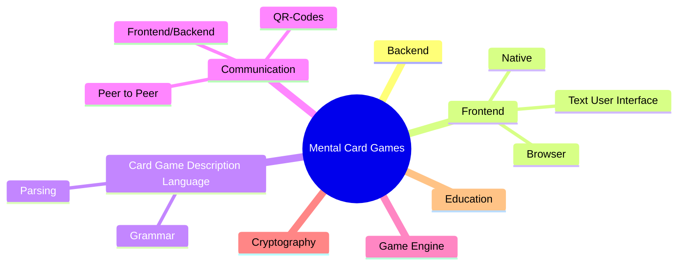

# Topics inside this Project

This page serves as a high-level roadmap to understanding
the diverse technical domains and components that
make up our ecosystem. 

Whether you are a new student onboarding onto the project
or a contributor exploring new areas,
the mindmap below illustrates the core pillars of our work.
By familiarizing yourself with these domains —
spanning from the Card Game Description Language
to Cryptography and Peer-to-Peer Communication —
you will gain the foundational context needed to navigate
the codebase and find the area that best aligns with your interests.

Take a moment to explore the visual breakdown of the project landscape:

