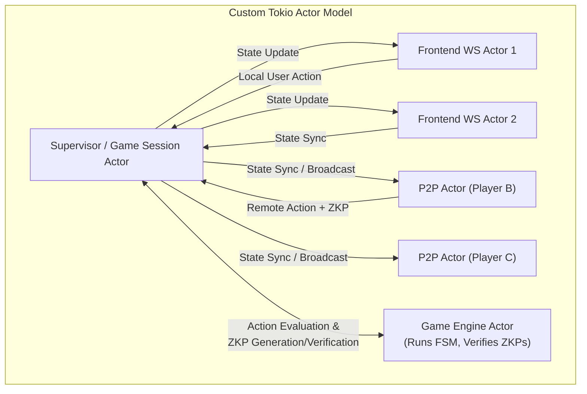
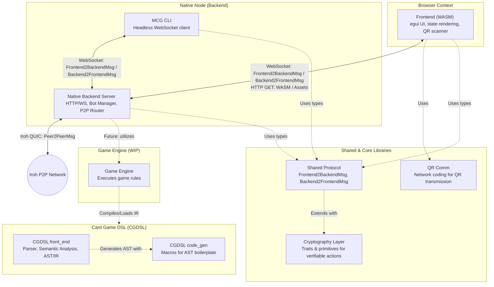

# System Paradigms

## Overview

The application follows a **Frontend-Backend / P2P Node** architecture. The system is designed around a **Split Node** concept where each player runs their own local Backend and Frontend, eventually communicating peer-to-peer over decentralized transports. To keep the project decoupled, clean, and highly secure, our development is guided by several core architectural paradigms and software patterns.

---

## Software-Patterns

### 1. Split Node Pattern
The entire system is structured as a **Split Node**.
* **Each Player is a Node:** Rather than players connecting to a centralized game server, every individual user runs a full local instance. This instance comprises both a browser-based client and a native desktop backend.
* **Native Power:** The native backend handles all resource-heavy operations: executing the game engine FSM, generating zero-knowledge proofs (ZKPs), and managing peer-to-peer sockets. This bypasses browser sandbox restrictions and performance bottlenecks (lack of direct OS threads or raw TCP/UDP networking).

### 2. Backend Peer Pattern
The backend server acts as a **Peer** in the decentralized network.
* **Dual Responsibility:** The backend serves static assets and establishes local connections with its own user's frontend. Simultaneously, it connects directly with remote backend instances of other players in the game lobby.
* **Decentralized Coordination:** The backend peer acts as a local authoritative state supervisor, routing network actions, verifying cryptographic shuffles, and gossiping game updates peer-to-peer.

### 3. WebAssembly Frontend Pattern
The visual client is compiled to **WebAssembly (WASM)**.
* **High-Performance In-Browser Rendering:** Built in Rust using `egui` (via `eframe`), the frontend compiles to WASM and runs inside any standard browser engine.
* **Direct UI Loop:** It leverages immediate-mode rendering for a highly responsive user experience, utilizing native browser canvas and WebGL/WebGPU graphics.

### 4. Model-View-Controller (MVC) Pattern
We utilize an MVC paradigm to cleanly separate user interfaces from core game state execution.

```
       ┌────────────────────────────────────────────────────────┐
       │                   SPLIT PLAYER NODE                    │
       │                                                        │
       │  ┌───────────────┐                  ┌───────────────┐  │
       │  │     VIEW      │  User Input Msg  │  CONTROLLER   │  │
       │  │ (Thin WASM)   ├─────────────────>│   (Backend)   │  │
       │  └───────▲───────┘                  └───────┬───────┘  │
       │          │                                  │          │
       │          │ State Broadcast                  │ Actions  │
       │          │                                  ▼          │
       │  ┌───────┴───────┐                  ┌───────────────┐  │
       │  │     MODEL     │  FSM State Update│ Game Engine   │  │
       │  │  (Replicated) │<─────────────────┤ (Model-Engine)│  │
       │  └───────────────┘                  └───────────────┘  │
       └────────────────────────────────────────────────────────┘
```

#### Thin View-Client
The browser-based WASM frontend is strictly a **stateless view and input layer**.
* **Paradigm Law:** The client is responsible only for rendering graphics based on incoming state and mapping user clicks into network events. 
* **State Decoupling:** No core game calculations, card shuffles, draws, or rule validations should *ever* be authored or executed in the client. This enforces a strict security boundary where the client cannot cheat.

#### Model-Engine
The game engine acts as the authoritative **Model-Engine** running on the native backend.
* **State Machine Authority:** The game engine executes a strict deterministic Finite State Machine (FSM) compiled from game rules. It is the sole component allowed to transition the game state, perform shuffles, and generate ZKPs verifying fair play.

### 5. Actor-Based Connection Pattern
To handle the high complexity of multiple asynchronous connections (local WebSockets from the frontend, remote peer connections, bot simulation loops), the backend utilizes a custom **Tokio-based Actor Model** using channels for message passing.

* **Sequential Execution:** By encapsulating connections within isolated actors, state changes are processed sequentially, completely preventing race conditions and thread synchronization bottlenecks.



* **Action Message Flow:**
  1. The player submits an action in their WASM frontend.
  2. The local `Frontend WS Actor` receives the message and forwards it via a `tokio::sync::mpsc` channel to the `Supervisor`.
  3. The `Supervisor` queries the `Game Engine Actor` to evaluate the action, shuffles cards, and generates cryptographic zero-knowledge proofs.
  4. The `Supervisor` updates the local state and broadcasts it to all connected `Frontend WS Actors` and remote `P2P Actors` via channels.

### 6. Breaking Cyclic-Dependencies Pattern
To maintain code health and rapid build times in a Rust workspace, we enforce strict compilation boundaries to break compilation cycles.
* **Shared Abstraction Layer:** To prevent the `frontend` and the `native_mcg` backend from relying on circular imports, we extract all core interfaces, domain objects, and communication enums into a standalone `shared` crate.
* **Uni-directional Graph:** Both backend and frontend depend solely on the `shared` crate. The `shared` crate depends on absolutely nothing in the workspace, ensuring a clean, compilation-friendly directed acyclic graph (DAG).

### 7. Common Interface Pattern (Gleiche Datentypen verwenden)
To preserve structural safety across different execution environments, all data flowing across boundaries must conform to contract-bound interface enums.
* **Shared Core Datatypes:** We share identical, serialized enums across our WebAssembly browser runtime and the native Rust desktop runtime.
* **Contract-Bound Sockets:** All message streams (local WebSockets, remote P2P, CLI streams) are strictly bound to identical enums defined in the `shared` crate:
  - `Frontend2BackendMsg`: Sent from the frontend to the local backend.
  - `Backend2FrontendMsg`: Broadcast from the backend to connected frontends.
  - `Peer2PeerMsg`: Distributed across backend peer-to-peer nodes.

### 8. Non-Blocking Async Actors Pattern
The native backend connection supervisor relies on a lightweight, single-threaded execution loop.
* **Async Safety Law:** Asynchronous message loops must never execute blocking synchronous calls or long-running computations, as this would freeze communication for all connected users.
* **Offloaded Heavy Math:** Any heavy cryptographic computations (such as generating or verifying zero-knowledge proofs) or disk operations are offloaded to dedicated worker threadpools (e.g., using `tokio::task::spawn_blocking` or separate dedicated actors).

---

## Component Interaction Architecture

The following diagram illustrates the component structure in the workspace, their relationships, and the communication paths within a single player's Node, as well as its connection to the outside world.



### Component Interaction Diagram


