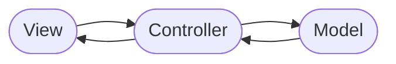
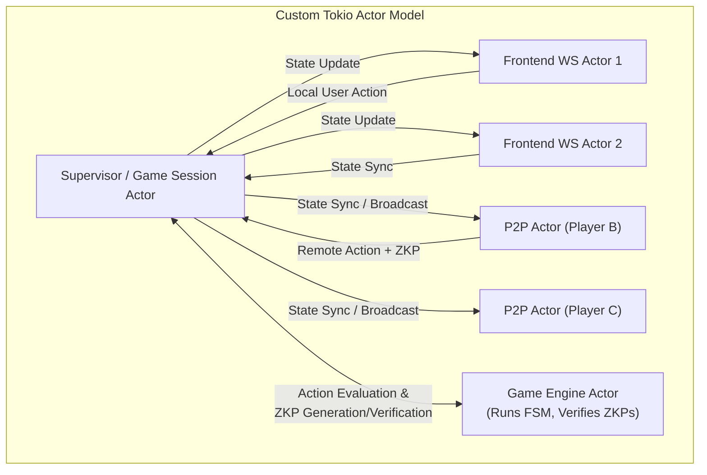
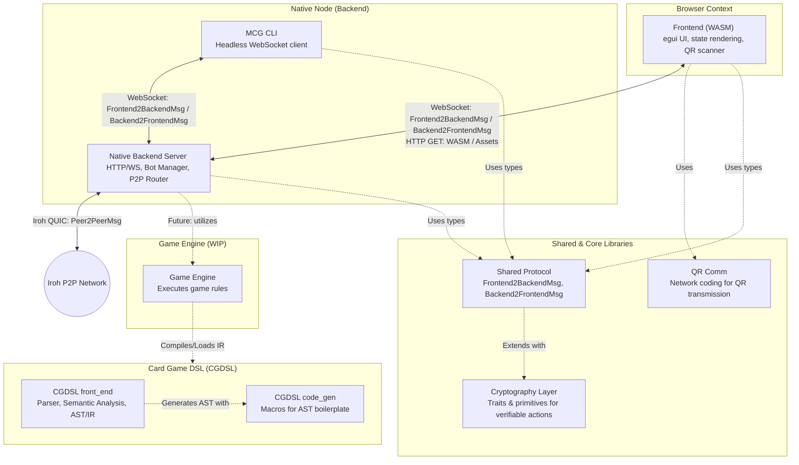
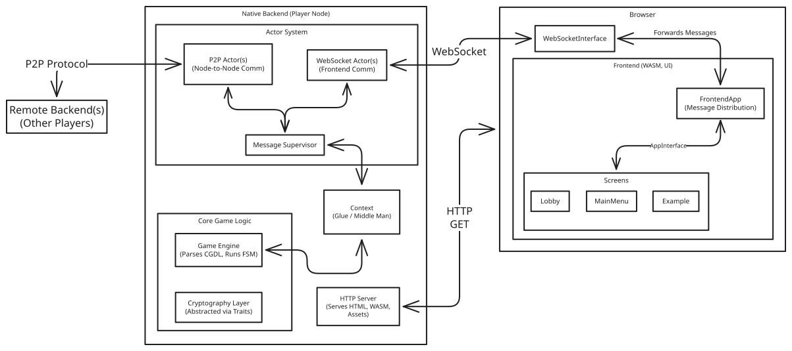

# System Design

::: danger
TODO: Update the remaining website to refere to this page with its new name "system design".
:::

This page serves as a comprehensive guide to the **architectural paradigms** and **software patterns** that govern the development of the Mental Card Game (MCG) ecosystem. 

For developers, project members, and contributors, this document outlines the fundamental design rules, architectural decisions, and structural boundaries of the codebase. By exploring this page, you will find:
* **Detailed explanations** of important software pattern and paradigm used in the project.
* **Structural models and diagrams** illustrating how components interact with eachother if appropriate.
* **The rationale behind key decisions** (such as security boundaries, decentralization, and dependency management) to help you gain a strong intuition for the system.

These paradigms serve as a guide for the development of current and future features, helping developers understand the decisions that imply the implementations. By adhering to these principles, we ensure that new code remains clean, decoupled, and secure.

## Split Node

In the distributed context of this project, gameplay occurs in a decentralized, peer-to-peer network with no central trusted party. Instead of connecting to a single authoritative server, players connect directly to each other as equal peers. Consequently, every participant runs a self-contained setup that represents a single node in this peer-to-peer topology.

To handle this environment cleanly and securely, the project separates each player's node into two distinct components: a **Frontend** for visualization and a **Backend** for computation.
This division ensures a clean separation of concerns and forms the foundation of our local node architecture.

::: danger
TODO: Insert here a small diagramm of five players connected in a ring together.
Each player is a "split" node.
The frontend of each player is one normal node and connected to the backend.
The backend of each player is one normal node as well.
Only the backend nodes have connections to other players in the ring.
There should be an oval over each frontend and backend pair.
:::

### WASM Frontend

The frontend is responsible entirely for visualization, rendering, and managing the user interface.
It is compiled to [WebAssembly (WASM)](https://webassembly.org/) — a low-level binary instruction format designed as a high-performance compilation target for compiled languages.

Our goal is to make this project easily usable and capable of targeting as many devices as possible.
Since web browsers are already universally widespread, they are the natural platform for client-side rendering.
While traditional web visuals are structured using HTML and CSS, WebAssembly is a compelling alternative for multiple reasons.

* **Direct Canvas Control:** The `<canvas>` is completely controlled and drawn onto by the WebAssembly binary, bypassing standard DOM layout overhead.
* **Minimal HTML Footprint:** We serve a very lean HTML file containing a single `<canvas>` element.
* **Single-Language Codebase:** Since Rust has first-class support for compiling to WASM, the HTML canvas is ultimately controlled entirely from Rust. This allows the entire project to be written in a single language, enabling seamless data-type sharing and reducing development complexity.

### Native Backend

The backend runs as a local desktop service on the user's machine, acting as a self-contained peer in the decentralized network. It serves as a connection gateway, bridging the human player's interactions on the frontend to the peer-to-peer network.

Additionally, the backend serves the WASM frontend binary and static media assets and also all other integration responsibilities are implemented here. This integration acts as the glue that merges all components into a cohesive, unified whole, ensuring the system operates as a single, well-working entity.

## Model-View-Controller (MVC)

We utilize an MVC paradigm to cleanly separate user interfaces from core game state execution. At its core, this pattern divides responsibilities into three distinct roles:

* **Model:** Responsible solely for managing the application data. It provides the set of instructions and rules applied to the data, guaranteeing that the state always remains consistent.
* **View:** Responsible for displaying an interface representing the data and detecting user input.
* **Controller:** Sits in between both the Model and the View and mediates between them. The View notifies the Controller about user input, which is then translated into the correct instruction for the Model. Conversely, the Model notifies the Controller about changes to the data, which are then relayed back to the View.

### View Frontend

The browser-based WebAssembly frontend implements only the **View** component of the MVC triad; the Model and Controller are entirely absent. 

To achieve this, the frontend utilizes a *thin client* approach.
Rather than managing game rules or storing the complete game state,
it simply receives some state projection from the backend.
The frontend is organized around a registry of multiple screens.
Each screen is responsible only for rendering a specific subset of the total data
and capturing user inputs to send back as messages.

### Model & Controller Backend

The backend manages various facets of the application's state through dedicated models.
For instance, the card game rules and state machine represent one model (the Game Engine),
while peer-to-peer connectivity and lobby memberships represent another model.
Each component's data and state consistency rules are encapsulated in its respective model.

A single, central controller mediates between these models and all external interfaces.
When a remote peer sends a message, the controller processes it as an input event,
updates the appropriate models,
and broadcasts the resulting state changes back to both the local frontend and remote peers.

## Actor-Based Environment

::: danger
TODO:

Change this section (Actor-Based Environment) to a different structure.
I want it to start with a brief motivation why and where the need for actors comes from.
For this you need to mention deadlocks, async and mental overhead in developement.

This motivation should be followed by an explenation how actors make developement better,
what they are and how they work.
:::

To handle the high complexity of multiple asynchronous connections (local WebSockets from the frontend, remote peer connections, bot simulation loops), the backend utilizes a custom **Tokio-based Actor Model** using channels for message passing.

* **Sequential Execution:** By encapsulating connections within isolated actors, state changes are processed sequentially, completely preventing race conditions and thread synchronization bottlenecks.

* **Action Message Flow:**
  1. The player submits an action in their WASM frontend.
  2. The local `Frontend WS Actor` receives the message and forwards it via a `tokio::sync::mpsc` channel to the `Supervisor`.
  3. The `Supervisor` queries the `Game Engine Actor` to evaluate the action, shuffles cards, and generates cryptographic zero-knowledge proofs.
  4. The `Supervisor` updates the local state and broadcasts it to all connected `Frontend WS Actors` and remote `P2P Actors` via channels.

## Breaking Cyclic-Dependencies Pattern
To maintain code health and rapid build times in a Rust workspace, we enforce strict compilation boundaries to break compilation cycles.
* **Shared Abstraction Layer:** To prevent the `frontend` and the `native_mcg` backend from relying on circular imports, we extract all core interfaces, domain objects, and communication enums into a standalone `shared` crate.
* **Uni-directional Graph:** Both backend and frontend depend solely on the `shared` crate. The `shared` crate depends on absolutely nothing in the workspace, ensuring a clean, compilation-friendly directed acyclic graph (DAG).

## Common Interface Pattern (Gleiche Datentypen verwenden)
To preserve structural safety across different execution environments, all data flowing across boundaries must conform to contract-bound interface enums.
* **Shared Core Datatypes:** We share identical, serialized enums across our WebAssembly browser runtime and the native Rust desktop runtime.
* **Contract-Bound Sockets:** All message streams (local WebSockets, remote P2P, CLI streams) are strictly bound to identical enums defined in the `shared` crate:
  - `Frontend2BackendMsg`: Sent from the frontend to the local backend.
  - `Backend2FrontendMsg`: Broadcast from the backend to connected frontends.
  - `Peer2PeerMsg`: Distributed across backend peer-to-peer nodes.

## Non-Blocking Async Actors Pattern
The native backend connection supervisor relies on a lightweight, single-threaded execution loop.
* **Async Safety Law:** Asynchronous message loops must never execute blocking synchronous calls or long-running computations, as this would freeze communication for all connected users.
* **Offloaded Heavy Math:** Any heavy cryptographic computations (such as generating or verifying zero-knowledge proofs) or disk operations are offloaded to dedicated worker threadpools (e.g., using `tokio::task::spawn_blocking` or separate dedicated actors).

## Component Interaction Architecture

The following diagram illustrates the component structure in the workspace, their relationships, and the communication paths within a single player's Node, as well as its connection to the outside world.

### Component Interaction Diagram

