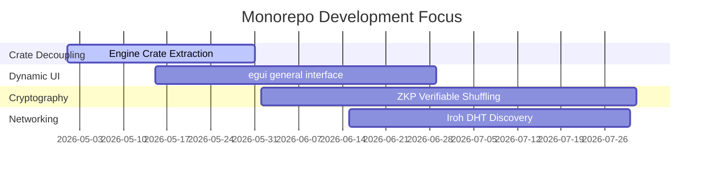

# Technical User Stories

This roadmap acts as our engineering execution board, translating our high-level milestones and research objectives into active development tracks. It lists the current bugs, refactorings, and feature requests that shape the day-to-day work in the repository.

---

## Active Development Tracks

---

## 1. Track 1: CGDL Engine & Monorepo Restructuring

We are focused on cleaning up compilation dependencies and building a highly reusable game engine.

* **Bugs:**
  - Decouple the frontend view loop from the authoritative Poker state (currently triggers compile errors if structures in `shared` change).
* **Refactorings:**
  - **Crates Folder Migration (High Priority):** Migrate root-level workspace crates `/frontend`, `/native_mcg`, and `/shared` under a clean, unified `/crates/` subdirectory to simplify the root monorepo layout.
  - Extract the Poker FSM from the backend and move it into an isolated crate `crates/engine_poker`.
* **Feature Requests:**
  - Standardize a generic `Engine` trait that the CGDL interpreter and future game modules will implement.

---

## 2. Track 2: Decoupled & Dynamic UIs

Providing a dynamic interface that adapts to dynamic game engines.

* **Refactorings:**
  - Refactor `ScreenDef` and `ScreenWidget` inside the WASM client to allow rendering layouts dynamically from a list of zone blueprints.
* **Feature Requests:**
  - Implement a terminal-based text client (`mcg-cli`) that connects to the backend over WebSockets to let developers rapidly execute state transitions without loading browser engines.

---

## 3. Track 3: Card Cryptography & Zero-Knowledge Proofs

Transitioning card distribution from trusted-server model to client-driven zero-knowledge equations.

* **Refactorings:**
  - Define clear traits for card shuffling and drawing to allow swapping different mathematical implementations.
* **Feature Requests:**
  - Integrate a proof-of-concept cryptographic library (e.g. `arkworks` ecosystem).
  - Benchmark proof generation and verification times on mobile web browsers to verify performance guardrails.

---

## 4. Track 4: P2P Networking & Node Discovery

Building reliable direct messaging and distributed synchronization across split-node players.

* **Bugs:**
  - Fix WebSocket frame dropouts during rapid UI interactions.
  - Resolve socket buffer leaks on client disconnects.
* **Feature Requests:**
  - Integrate Iroh’s Distributed Hash Table (DHT) to allow nodes to discover and bootstrap connections without a coordinate broker.
  - Implement vector clocks in backend message headers to ensure deterministic orderings of peer inputs.
