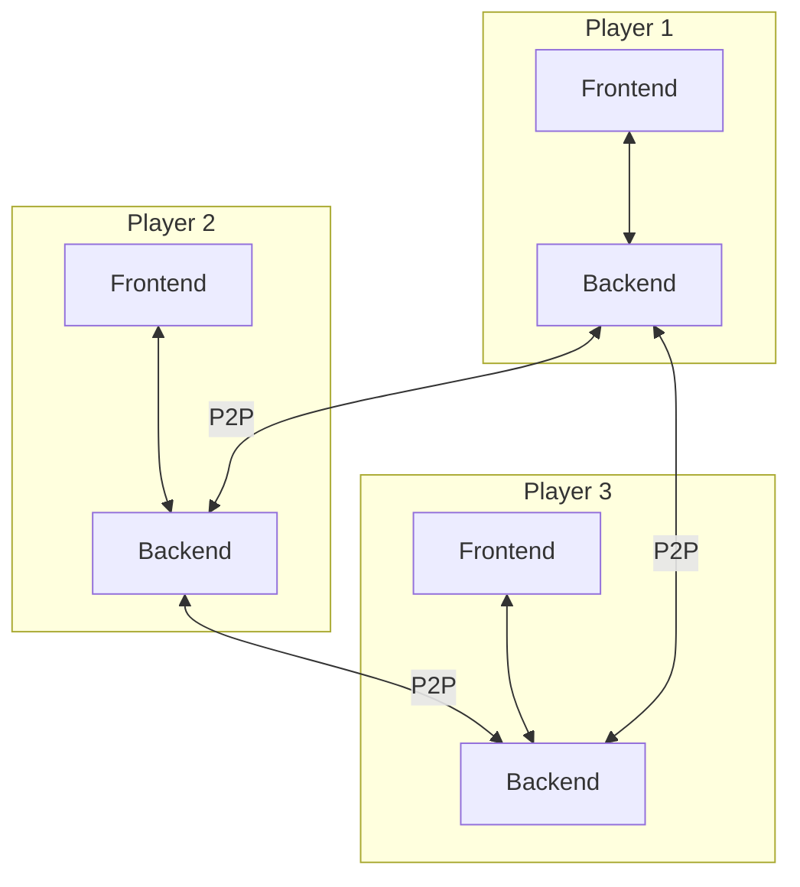
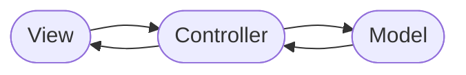
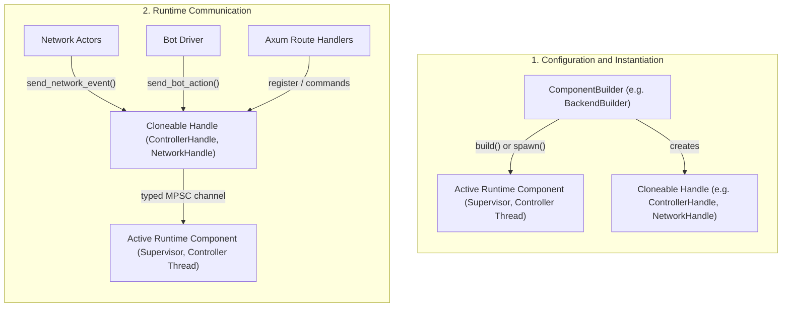
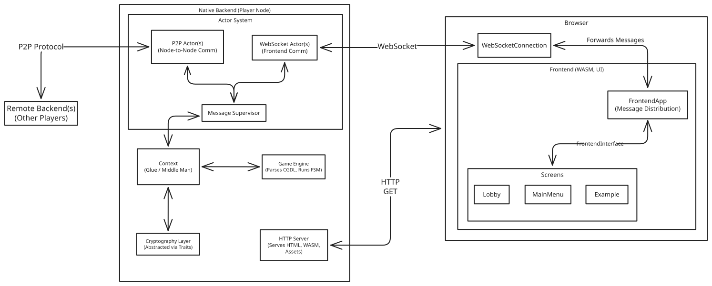

# System Design

This page describes the **architectural goal state** and the software patterns
guiding development of the Mental Card Game (MCG) ecosystem.

For developers, project members, and contributors, this document outlines the
fundamental design rules, architectural decisions, and structural boundaries of
the codebase.
By exploring this page, you will find:

* **Detailed explanations** of important software pattern and paradigm used in
  the project.
* **Structural models and diagrams** illustrating how components interact with
  eachother if appropriate.
* **The rationale behind key decisions** (such as security boundaries,
  decentralization, and dependency management) to help you gain a strong
  intuition for the system.

::: warning
These paradigms guide current and future work.
They document the boundaries the project is moving toward so that incremental
implementations remain decoupled and compatible with the intended architecture.

The current state may or may not be accurate to this description.
:::

## Split Node

The project aims for gameplay in a decentralized, peer-to-peer network with no
central trusted party.
In that goal state, players connect directly to each other as equal peers and
every participant runs a self-contained node.

To handle this environment cleanly and securely, the project separates each
player's node into two distinct components:
a **Frontend** for visualization and a **Backend** for computation.
This division ensures a clean separation of concerns and forms the foundation
of our local node architecture.

### WASM Frontend

The frontend is responsible entirely for visualization, rendering, and managing
the user interface.
It is compiled to [WebAssembly (WASM)](https://webassembly.org/) — a low-level
binary instruction format designed as a high-performance compilation target for
compiled languages.

Our goal is to make this project easily usable and capable of targeting as many
devices as possible.
Since web browsers are already universally widespread, they are the natural
platform for client-side rendering.
While traditional web visuals are structured using HTML and CSS, WebAssembly is
a compelling alternative for multiple reasons.

* **Direct Canvas Control:**
  The `<canvas>` is completely controlled and drawn onto by the WebAssembly
  binary, bypassing standard DOM layout overhead.
* **Minimal HTML Footprint:**
  We serve a very lean HTML file containing a single `<canvas>` element.
* **Single-Language Codebase:**
  Since Rust has first-class support for compiling to WASM, the HTML canvas is
  ultimately controlled entirely from Rust.
  This allows the entire project to be written in a single language, enabling
  seamless data-type sharing and reducing development complexity.

### Native Backend

The backend runs as a local desktop service on the user's machine, acting as a
self-contained peer in the decentralized network.
It serves as a connection gateway, bridging the human player's interactions on
the frontend to the peer-to-peer network.

Additionally, the backend serves the WASM frontend binary and static media
assets and also all other integration responsibilities are implemented here.
This integration acts as the glue that merges all components into a cohesive,
unified whole, ensuring the system operates as a single, well-working entity.

## Model-View-Controller (MVC)

MVC is the target paradigm for separating user interfaces from core game-state
execution.
It divides responsibilities into three distinct roles:

* **Model:**
  Responsible solely for managing the application data.
  It provides the set of instructions and rules applied to the data, guaranteeing
  that the state always remains consistent.
* **View:**
  Responsible for displaying an interface representing the data and detecting
  user input.
* **Controller:**
  Sits in between both the Model and the View and mediates between them.
  The View notifies the Controller about user input, which is then translated
  into the correct instruction for the Model.
  Conversely, the Model notifies the Controller about changes to the data, which
  are then relayed back to the View.

### View Frontend

The browser-based WebAssembly frontend implements only the **View** component
of the MVC triad; the Model and Controller are entirely absent.

To achieve this, the frontend utilizes a *thin client* approach.
Rather than managing game rules or storing the complete game state, it simply
receives some state projection from the backend.
The frontend is organized around a registry of multiple screens.
Each screen is responsible only for rendering a specific subset of the total
data and capturing user inputs to send back as messages.

### Model & Controller Backend

The backend manages various facets of the application's state through dedicated
models.
For instance, the card game rules and state machine represent one model (the
Game Engine), while peer-to-peer connectivity and lobby memberships represent
another model.
Each component's data and state consistency rules are encapsulated in its
respective model.

A single, central Controller is intended to mediate between these models and
all external interfaces.
When implemented, it will process remote messages as input events, update the
appropriate models, and broadcast resulting state changes to the local frontend
and remote peers.

## Goal-State Hybrid Execution Environment

To keep game logic, state machines, and cryptographic protocols clean,
decoupled, and easy to maintain, the backend is moving toward a
**Hybrid Execution Model**.
This model splits responsibilities into an asynchronous network shell and a
single-threaded synchronous core.

### Asynchronous Network Shell

The asynchronous network shell manages the concurrent, I/O-heavy communication
boundaries of the local node.
Running on Tokio, each active connection uses a lightweight actor task.

Rather than modifying the application state directly, connection handlers in the
async shell function as simple **actors**.
They deserialize incoming bytes into structured enums such as
`Frontend2BackendMsg` and `Peer2PeerMsg` and report typed events through the
`NetworkSupervisor`.

### Synchronous Controller Core (Goal State)

This component is planned and is **not yet implemented**.
A dedicated OS thread will run a synchronous event loop acting as the
centralized **Controller** in the MVC design.
It will have sole, lock-free ownership of the game-engine execution state and
lobby configuration (the **Model**).

The planned Controller will execute a continuous step-by-step event loop:

1. It blocks on the incoming MPSC channel, waiting for message packets.
2. It dequeues a message, identifies the actor, and applies the logic to the
   Model.
3. It updates the state, formats state projections, and sends them to all peers
   as defined by protocols.

## Breaking Cyclic-Dependencies Pattern

To maintain code health and rapid build times in a Rust workspace, we enforce
strict compilation boundaries to break compilation cycles.

* **Shared Abstraction Layer:**
  To prevent the `frontend` and the `native_mcg` backend from relying on circular
  imports, we extract all core interfaces, domain objects, and communication
  enums into a standalone `shared` crate.
* **Uni-directional Graph:**
  Both backend and frontend depend solely on the `shared` crate.
  The `shared` crate depends on absolutely nothing in the workspace, ensuring a
  clean, compilation-friendly directed acyclic graph (DAG).

## Common Interface Pattern

To preserve structural safety across different execution environments, all data
flowing across boundaries must conform to contract-bound interface enums.

* **Shared Core Datatypes:**
  We share identical, serialized enums across our WebAssembly browser runtime and
  the native Rust desktop runtime.
* **Contract-Bound Sockets:**
  All message streams (local WebSockets, remote P2P, CLI streams) are strictly
  bound to identical enums defined in the `shared` crate:
  * `Frontend2BackendMsg`: Sent from the frontend to the local backend.
  * `Backend2FrontendMsg`: Broadcast from the backend to connected frontends.
  * `Peer2PeerMsg`: Distributed across backend peer-to-peer nodes.

## Builder and Handle Pattern

To decouple component configuration, lifecycle management, and runtime
communication across asynchronous and synchronous execution boundaries, the
backend applies the **Builder** and **Handle** patterns.

### The Builder Pattern

Constructing backend subsystems involves complex configuration:
discovering and binding network ports, sizing bounded channel buffers,
resolving file paths, specifying connection timeouts, and injecting mock
network connectors for testing.

**Fluent Configuration via `with_*` Methods:**
Builders provide a chainable, ergonomic configuration API following idiomatic
Rust conventions.
Initialized with sensible defaults via `new(...)`, optional parameters and
environmental overrides are applied fluently via `with_*` methods
(e.g., `with_port()`, `with_channel_capacity()`, or `with_iroh_connector()`).
These methods consume and return ownership of `mut self`, guaranteeing
compile-time immutability once the builder is finalized by `build()` or `spawn()`.

**Staged Lifecycle (`build()` vs. `spawn()`):**

- `build()`:
Resolves system resources (such as scanning for available ports or verifying
strict port availability), allocates internal communication channels, and
initializes state structures without launching background tasks or threads.
- `spawn()`:
Starts the background Tokio tasks (`NetworkSupervisor`, bot driver) or
dedicated OS threads (`ControllerRunner`), returning the active runtime handles
and task join guards.

**Deterministic Resource Resolution:**
Resource discovery (such as scanning ports for an available socket) occurs
during the build phase before tasks start, avoiding race conditions during
startup.

**Ergonomics & Test Isolation:**
Test suites can easily customize buffer sizes, bind to ephemeral port `0`,
disable bot drivers, or inject in-memory transport connectors without mutating
configuration files on disk.

### Function of Handlers

In our hybrid execution model, the central synchronous controller and the
asynchronous network supervisor must not expose mutable shared state
(`Arc<Mutex<T>>`) across thread or task boundaries.
Instead, communication and control are delegated to **Handlers**.

A **Handle** (such as `ControllerHandle`, `NetworkHandle`, or `BackendHandle`)
is a lightweight, cloneable proxy created during the build step.
Its primary functions are:

**Message-Passing Abstraction:**
The handle encapsulates the sender half of internal MPSC (Multi-Producer,
Single-Consumer) or watch channels.
Instead of exposing raw channel primitives, it provides an ergonomic,
strongly-typed API (e.g., `send_network_event()`, or `send_bot_action()`).

**Crossing Execution Boundaries:**
Handles allow asynchronous Tokio tasks to safely communicate with the
synchronous `Controller` OS thread without locks, mutex contention, or 
cross-runtime blocking.

**Safe Concurrent Sharing:**
Handles implement `Clone + Send + Sync`.
Any number of network connection actors, background services, or HTTP/WebSocket
handlers can hold independent clones of the handle without contending for a
central lock.

**Orderly Lifecycle Control:**
Handles provide dedicated shutdown hooks (such as `handle.shutdown().await`),
coordinating clean disconnection across actors, listeners, and the controller
thread.

## Component Interaction Diagram

The following diagram illustrates the component structure in the workspace,
their relationships, and the communication paths within a single player's Node,
as well as its connection to the outside world.

